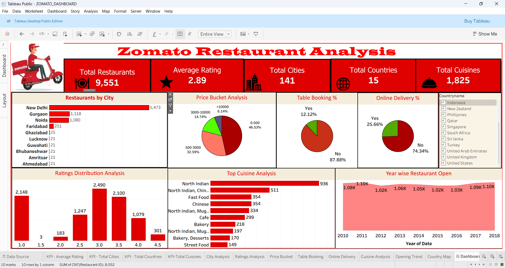

# Zomato Restaurant Analysis Dashboard

## Project Overview
This Tableau dashboard analyzes Zomato restaurant data to identify trends in ratings, cuisines, pricing, and online delivery services across different countries and cities.

## Tools Used
- Tableau
- Excel

## Key Insights
- Restaurant ratings analysis
- Country-wise restaurant distribution
- Online delivery availability
- Table booking analysis
- Cuisine popularity
- Price range trends

## KPIs
- Total Restaurants
- Average Rating
- Online Delivery %
- Table Booking %
- Countries Covered

## Dashboard Features
- Interactive filters
- KPI cards
- Maps visualization
- Pie charts
- Bar charts

## Dataset
The dataset contains restaurant information including ratings, cuisines, pricing, country, city, online delivery, and table booking details.

## Dashboard Preview

## Project Outcome
This project helps understand customer preferences, restaurant performance, and food service trends using interactive data visualization.
